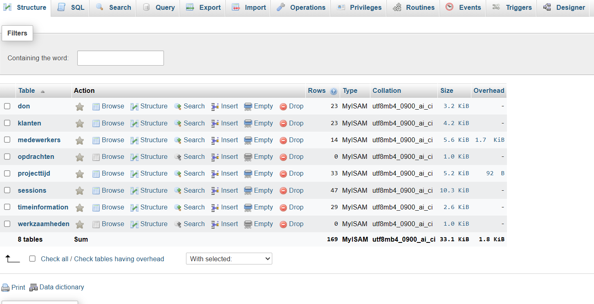

# React + TypeScript + Vite
This is a fully functioning hour system. 

Your database(MYSLQ) should kind look like this;

Werkzaamheden and projected table are empty and you can delete them.
But the rest of the tables are needed

timeinformation Table

sessions table.

projecttijd table

medewerkers table.

klanten table.

Don table.

Author: Abdul G Zziwa

